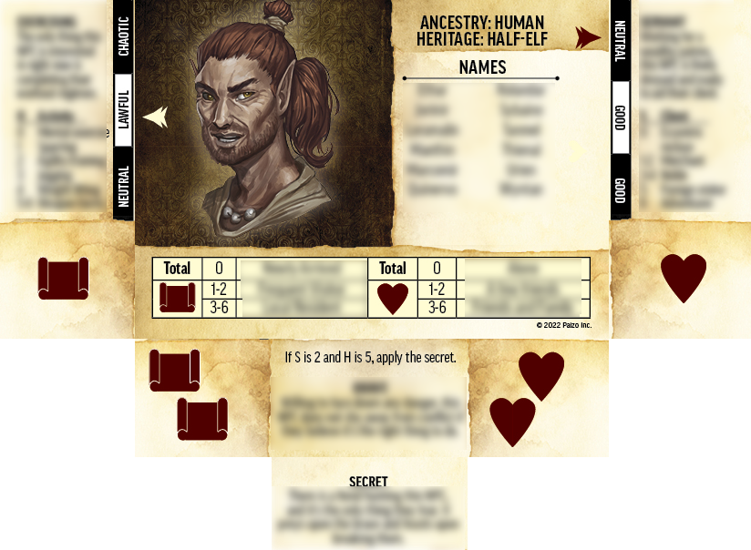

# Deck of Endless NPCs

## License
This script comes with ABSOLUTELY NO WARRANTY.
This is free software, and you are welcome to
redistribute it under certain conditions.
See 'LICENSE.txt' for details.

This script uses trademarks and/or copyrights owned by Paizo Inc.,
used under [Paizo's Community Use Policy](https://paizo.com/communityuse). 
I am expressly prohibited from charging you to use or access this
content.  This script is not published, endorsed, or specifically
approved by Paizo.  For more information about Paizo Inc. and
Paizo products, visit [paizo.com](https://paizo.com).

## Description
DeckEndlessNPCs is a script for digitally generating a Pathfinder NPC based on
[Paizo's Deck of Endless NPCs](https://paizo.com/products/btq02d82?Pathfinder-Deck-of-Endless-NPCs).

To use this script, you must own a digital copy of the Deck of
Endless NPCs.  The script generates an image of four cards overlapped
according to the rules of the Deck of Endless NPCs for generating
an NPC.

Place the folder containing the digital copy of the Deck of Endless
NPCs in JPEG format (.jpg), as downloaded from Paizo, in the same
folder as the decknpc.py file. By default, this folder is named 
"**PathfinderDeckOfEndlessNPCsDownload-JPGs**."  If your folder has a
different name or path, add as argument to script execution.

## Usage
`python3 decknpc.py [CARD JPG FOLDER]`
